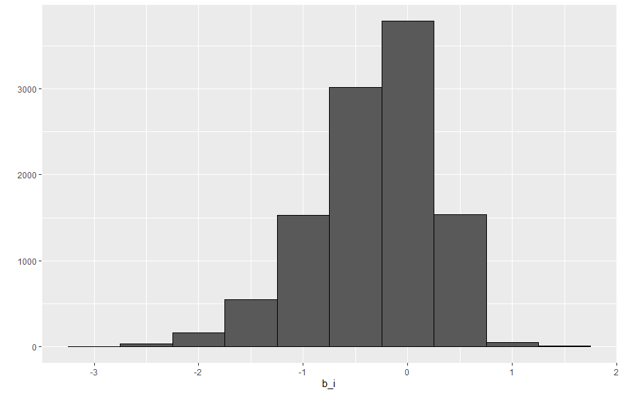
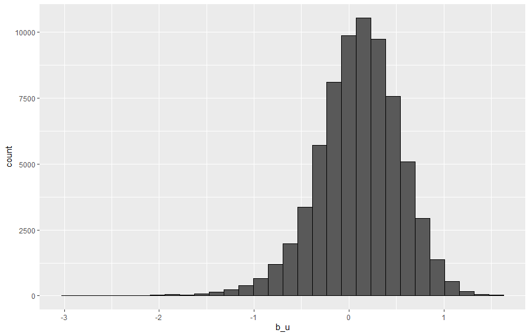
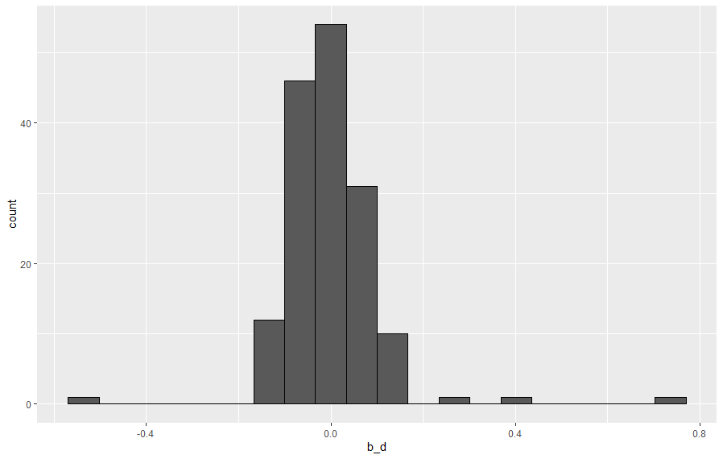
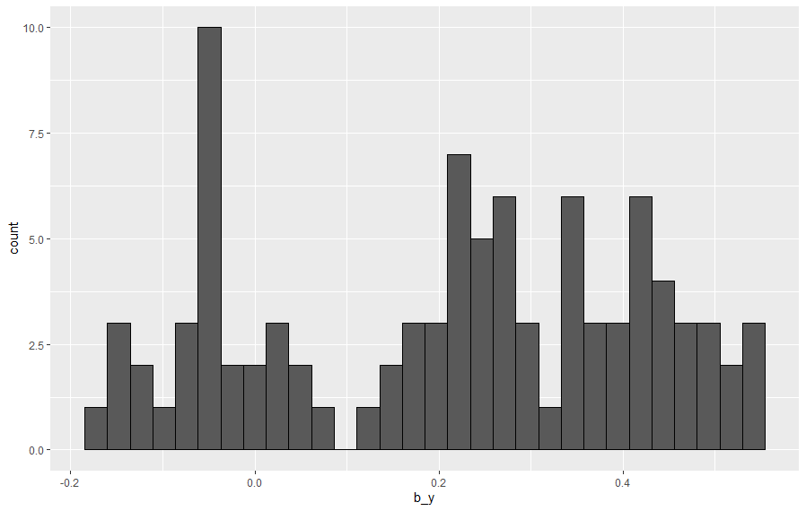
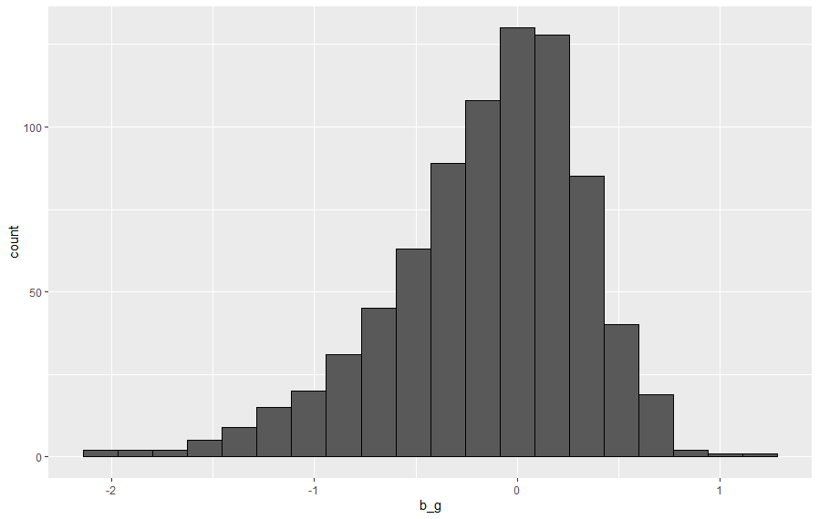

```{r setup, include=FALSE, echo=FALSE}
knitr::opts_chunk$set(echo = TRUE)
knitr::opts_chunk$set(error = TRUE)
```

## **Executive Summary**

This report is submitted as the first of two reports for the Final Project of **HarvardX PH125.9x**

The motivation for this report come from the Netflix Challenge, an open competition for the best collaborative filtering algorithm to predict user ratings for films.  The grand prize of $1,000,000 was given to the BellKor’s Pragmatic Chaos team which beat Netflix’s own algorithm for predicting ratings by more than 10%^1^.

The challenge for this Data Science Capstone class was to analyze a provided dataset and develop an algorithm for predicting ratings with a Root Mean Square Error (RMSE) of 0.86490 or lower.  Since Netflix data is not available to the public, the dataset utilized for this exercise is the MovieLens 10M dataset^2^, from GroupLens.org.  This dataset includes 10 million ratings of 10,000 movies by 72,000 users.

After seeing considerable variability across several factors, a series of biases were developed to account for the variability.  Incrementally applying one bias in an iterative effort showed steady improvement without achieving the challenge goal.  The biases considered include; movieId, userId, genres, release date, and date of review.  After regularization of each of these biases, the developed algorithm exceeded the requirement of 0.865490.


## **Method/Analyses**

The objective here is to predict what a future user will rate a movie based on what similar users have done in the past using similarities of information provided in the dataset.   

The movielens data set was downloaded with the code provided in appendix A, and saved in the movielens object.  Here is the summary of the data as provided:

```{r load movielens, eval=TRUE, include=FALSE}
load("./data/movielens.rdata")
```
```{r movielens summary, echo=FALSE}
summary(movielens)
```


The fields available for predicting the “rating” include “userId”, “movieId”, “timestamp”, and “genre.  The “movieId” field includes the year that the movie was released, and that year was extracted to a new field called “year”.  The timestamp is the date of the review and is provided in unix time.  The “timestamp” field was converted  year-month-day, year-month was extracted to a new field called “date”, and “timestamp” was removed from the dataset.  Below is a small sample of the cleaned data for analysis.

```{r load edx, eval=TRUE, include=FALSE}
load("./data/edx.rdata")
```

```{r cleaned data example, echo=FALSE}
head(edx, 3)
```

With the data cleaned up for analysis, the average rating per data fields was compared to the overall average of the dataset

Overall Average: 

```{r mu_hat, echo=FALSE}
mean(edx$rating)
```


## Including Plots

You can also embed plots, for example:

{width=50%}{width=50%}
{width=50%}{width=50%}
{width=50%}

Note that the `echo = FALSE` parameter was added to the code chunk to prevent printing of the R code that generated the plot.
adding a small change to see how git works

